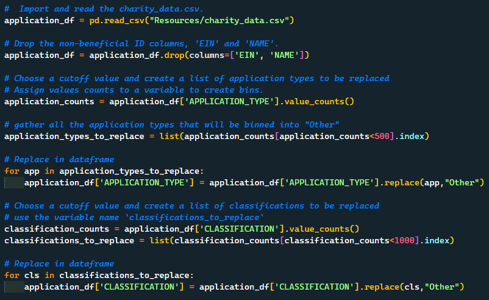
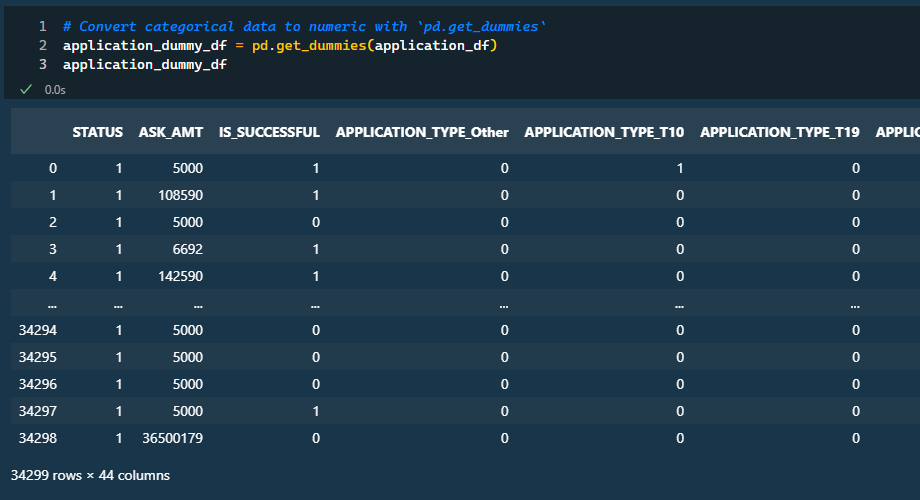
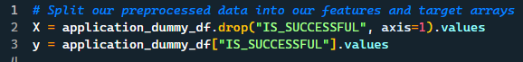
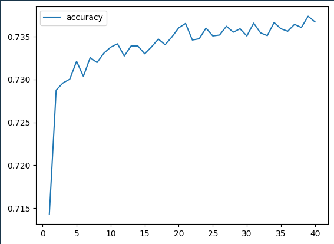
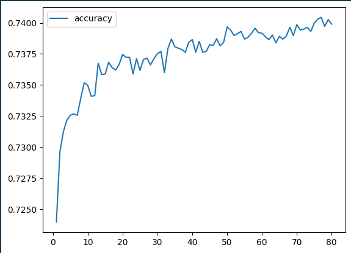

# deep-learning-challenge

# **Overview**

Alphabet Soup is seeking a tool that can assist in identifying the funding applicants who have the highest probability of succeeding in their ventures. To accomplish this objective, I will utilize neural network models with the given dataset and optimize the models to yield the most precise outcomes. The goal is to create a model with 75% accuracy. 

---

# Results

### Data Preprocessing

Initially, I eliminated ID columns (EIN, NAME) that are assumed to be not beneficial for the model and could hinder its performance. We began by making assumptions, which I later validated. Next, I grouped applicants and classifications and placed them in an "Other" bin for all the one-off funded accounts.

In order for the model to perform correctly, it cannot have string values. An easy way to covert string values to a interager or float is by uysing pd.get_dummies and create a new dataframe.

Now that the data is ready to load into a model, we can now split the target value and the features. I will be using the "IS_SUCCESSFUL" as the target and the remaining variables will be the features.

---

### Compiling, Training, and Evaluating the Model

**Initial Setup:**

**2 Layers:** 30 neurons for the first layer, and 25 nauerons for the second layer.

**Accuracy**: 215/215 - 0s - loss: 0.5604 - **accuracy: 0.7219** - 312ms/epoch - 1ms/step
Loss: 0.5604380369186401, Accuracy: 0.7218658924102783

**Result**: This model did not acheive the model target performance.

---

**Optimization Attempt 1:**  To get an idea of how the current features can be improved with parameter changes, I added additional layers and adjusted the neurons, while also shuffling the test data.

**3 Layers**: 80 neurons for the first layer, 30 nauerons for the second layer, 10 nauerons for the third layer.

**Accuracy**: 215/215 - 0s - loss: 0.5672 - **accuracy: 0.7227** - 267ms/epoch - 1ms/step
Loss: 0.5671753883361816, Accuracy: 0.7227405309677124

**Result**: Changing the parameters did not have any impact on the model performance. 

---

Optimization Attempt 1

3. **Summary** : Summarize the overall results of the deep learning model. Include a recommendation for how a different model could solve this classification problem, and then explain your recommendation.
