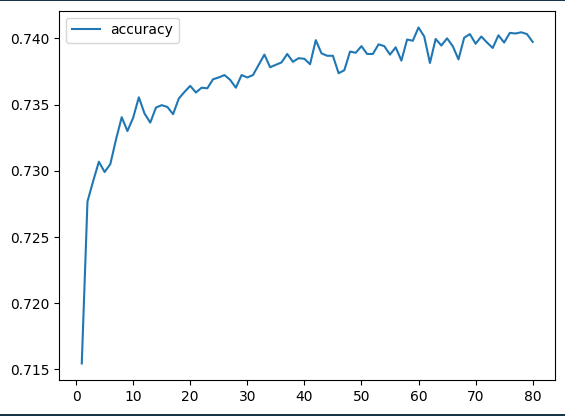
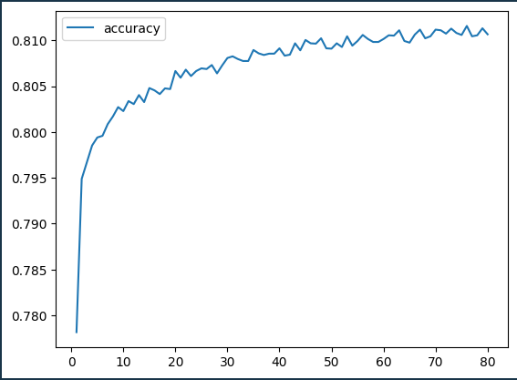

# Venture Success Analysis

This project aims to create a binary classifier deep learning model to predict the success of various charity organizations using TensorFlow. The goal is to help the Alphabet Soup organization identify which charities to prioritize based on the likelihood of the charity's success.

## Requirements

To run this code, you will need the following Python libraries:

* pandas
* sklearn
* tensorflow

## Usage

1. Download the `charity_data.csv` dataset and place it in the `Resources` folder.
2. Run the provided code to preprocess the data, train the deep learning model, and evaluate its performance.

## Overview

The code is structured in two parts:

### Part 1: Preprocessing

* Imports the necessary dependencies.
* Reads the charity dataset and drops the non-beneficial ID columns, 'EIN' and 'NAME'.
* Determines the number of unique values in each column.
* Bin the 'NAME', 'APPLICATION_TYPE', and 'CLASSIFICATION' columns to reduce the number of unique categories.
* Encodes the categorical data using one-hot encoding (`pd.get_dummies`).
* Splits the preprocessed data into training and testing sets.
* Scales the data using `StandardScaler`.

### Part 2: Compile, Train, and Evaluate the Model

* Defines a deep neural network model with two hidden layers and one output layer.
* Compiles the model using a binary cross-entropy loss function and the Adam optimizer.
* Trains the model with the scaled training data.
* Evaluates the model's performance using the scaled test data.
* Plots the model's accuracy during training.
* Saves the model's weights to an HDF5 file.

## Results

This project involved multiple iterations of data preprocessing and feature engineering to develop the best possible machine learning model. The steps taken are outlined below, which can be used as a reference to evaluate the approach taken. You may consider alternative methods or strategies based on your own experience and expertise.

### Data Preprocessing

Initially, eliminates ID columns (EIN, NAME) that are assumed to be not beneficial for the model and could hinder its performance. Begins by making assumptions, which is later validated. Next, groups applicants and classifications and places them in an "Other" bin for all the one-off funded accounts.

In order for the model to perform correctly, string values are converted string values to integers or floats is by using `pd.get_dummies`. 

Next it splits the target value and the features using the "IS_SUCCESSFUL" as the target and the remaining variables will be the features.

---

### Compiling, Training, and Evaluating the Model

**Initial Setup:**

**2 Layers:** 30 neurons for the first layer, and 25 nauerons for the second layer.

**Accuracy**: 215/215 - 0s - loss: 0.5604 - **accuracy: 0.7219** - 312ms/epoch - 1ms/step
Loss: 0.5604380369186401, Accuracy: 0.7218658924102783

**Result**: This model did not acheive the model target performance.

---

**Optimization Attempt 1:**  To get an idea of how the current features can be improved with parameter changes, I added additional layers and adjusted the neurons, while also shuffling the test data.

**3 Layers**: 80 neurons for the first layer, 30 nauerons for the second layer, 10 nauerons for the third layer.

**Accuracy**: 215/215 - 0s - loss: 0.5672 - **accuracy: 0.7227** - 267ms/epoch - 1ms/step
Loss: 0.5671753883361816, Accuracy: 0.7227405309677124

**Result**: Changing the parameters did not have any impact on the model performance.

---

**Optimization Attempt 2:** I attempted to bin the feature, ASK_AMT, to investigate whether reducing the ask amounts with a single request would be helpful.

**2 Layers:** 30 neurons for the first layer, and 25 nauerons for the second layer.

**Accuracy**: 215/215 - 0s - loss: 0.6299 - accuracy: 0.7220 - 161ms/epoch - 750us/step
Loss: 0.6298809051513672, Accuracy: 0.7220116853713989

**Result**: Binning the ASK_AMT had no impact on the model performance.

---

**Optimized (final attempt):** In my last attempt, I aimed to improve the accuracy performance of the model by incorporating additional features, specifically the name of the organizations.  I binned the data to group all organizations with less than 5 applications. Additionally, I increased the neuron count.

**2 Layers**: 80 neurons for the first layer, 30 nauerons for the second layer.

**Accuracy**: 215/215 - 0s - loss: 0.4742 - accuracy: 0.7866 - 296ms/epoch - 1ms/step
Loss: 0.47418802976608276, Accuracy: 0.7865889072418213

---

# **Conclusion**

By adding NAME and using binning techniques, along with adding more hidden layers and adjusting the number of neurons, the model's performance and stability improved. Based on the current data and features available, I consider this the most optimal outcome achievable (given the goal to reach at least 75%). Considering the model's intended use-case, it should be effective in determining the best allocation of funds for maximizing success.  If there is a desire to explore a more accurate model, I'd suggest looking into supervised learning Decision Tree or Recurrent Neural Networks models.
